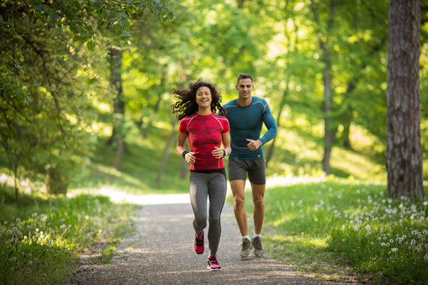

# Person in a Scene - Composite Image Generator

This project allows you to **insert a person into a background image** in a visually realistic way by:
- Detecting and extracting a person from the input image using **YOLOv8** and **REMBG**
- Cropping and cleaning the person mask
- Estimating height relative to people in the background
- Allowing interactive positioning
- Blending shadows, lighting, and color to create a photorealistic final image

---

##  Demo
([App Demo](https://person-in-a-scene-hneohw7evjfqszvkkyvm8w.streamlit.app/))

###  Input

| Person Image | Background Image |
|--------------|------------------|
|  |  |

###  Output

| Final Composite |
|-----------------|
|  |

---

##  How it works (Pipeline)

1. **Person Detection**
   - YOLOv8 detects the person in the image
   - Bounding box is drawn, person is extracted

2. **Background Removal**
   - `rembg` removes background cleanly
   - Person is masked and cropped tightly to reduce unwanted space

3. **Scene Analysis**
   - People in the background (if any) are detected
   - Height estimation is done to scale inserted person naturally

4. **Placement & UI**
   - You can **drag and place** the person in the scene
   - Adjust scale, position manually or rely on auto-scaling

5. **Blending**
   - Lighting direction is estimated
   - Shadows and colors are blended to match the scene

6. **Download**
   - The final composite image is generated and downloadable

---

##  Features

-  One-click composite generation
-  YOLO-based person detection
-  Background removal and tight cropping
-  Height scaling based on other people in the scene
-  Shadow & color blending for realism
-  Interactive UI with drag-and-drop placement
-  Save final image

---

##  Tech Stack

| Tool          | Purpose                      |
|---------------|------------------------------|
| YOLOv8        | Person detection             |
| REMBG         | Background removal           |
| OpenCV, PIL   | Image processing             |
| Streamlit     | UI interface                 |
| NumPy         | Array and mask operations    |

---

##  Folder Structure

```
person-in-a-scene/
│
├── app.py                # Streamlit app
├── utils.py              # Helper functions
├── requirements.txt      # Dependencies
├── assets/               # Placeholder for sample images
└── README.md             # Project documentation
```

---

##  Setup Instructions

###  Installation

```bash
git clone https://github.com/Hitika-Jain/person-in-a-scene.git
cd person-in-a-scene
pip install -r requirements.txt
```

###  Run Locally

```bash
streamlit run app.py
```

Then open the browser at `http://localhost:8501`

---

##  Example Input & Output

###  Person Image

_A person to be inserted into a scene._


<sub>(Example: jogging woman in a forest path)</sub>

---

###  Background Image

_Any arbitrary scene image._


---

###  Output (Final Composite)

_A photorealistic image with seamless placement._


---

##  Use Cases

- AR/VR and avatar placement
- Image compositing and mockups
- Academic projects (computer vision, media)
- Creative photo editing apps

---

##  Author

Built by [Hitika Jain](https://github.com/Hitika-Jain) with 💙

---

##  License

This project is open-sourced under the **MIT License**.
